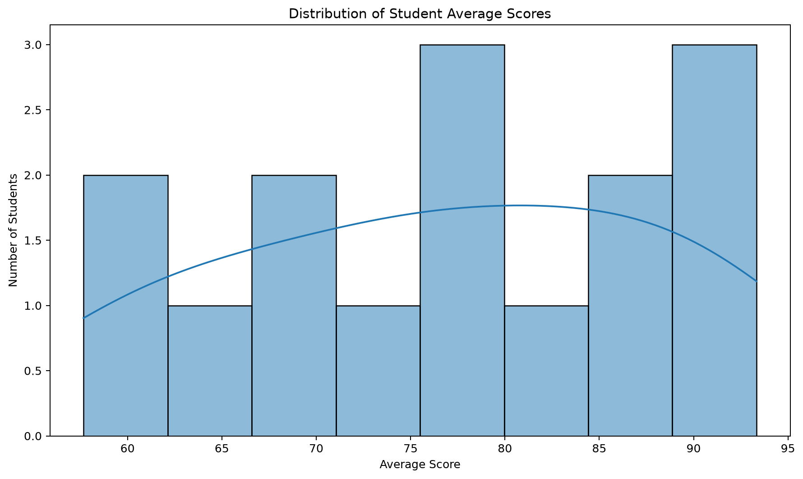
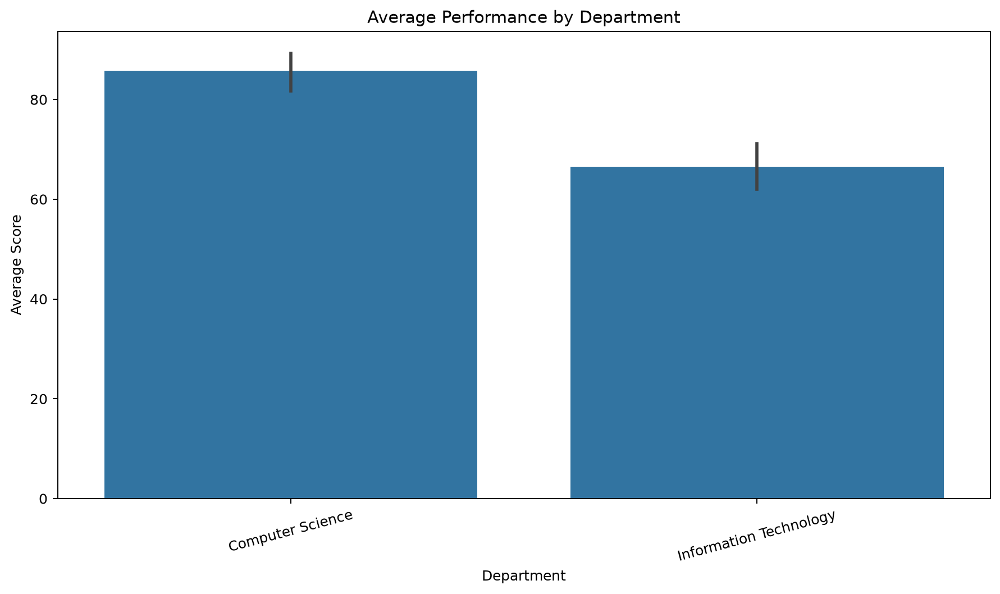
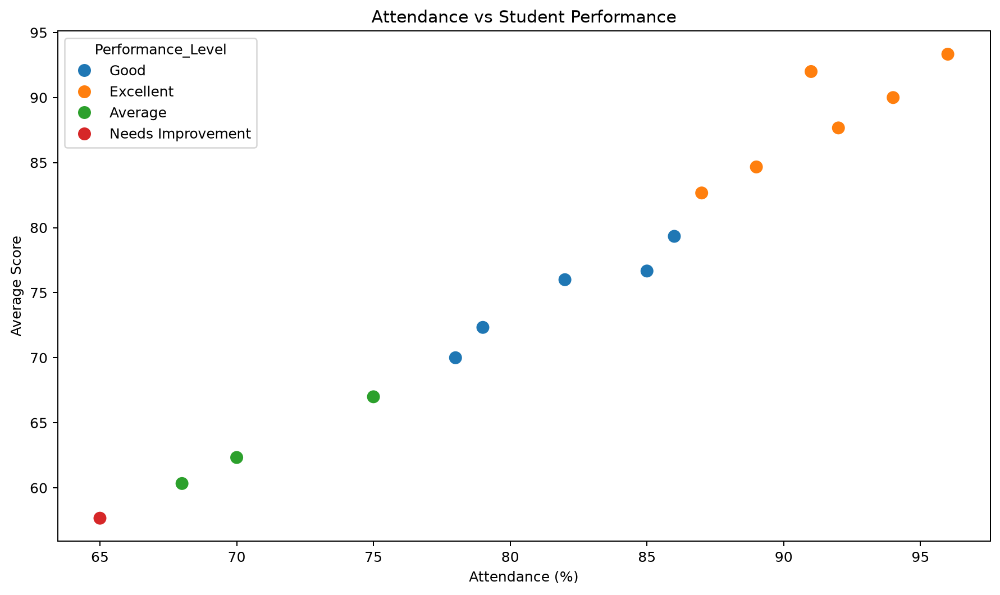
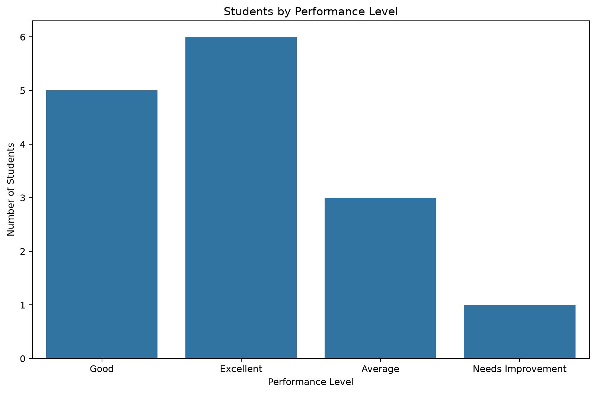
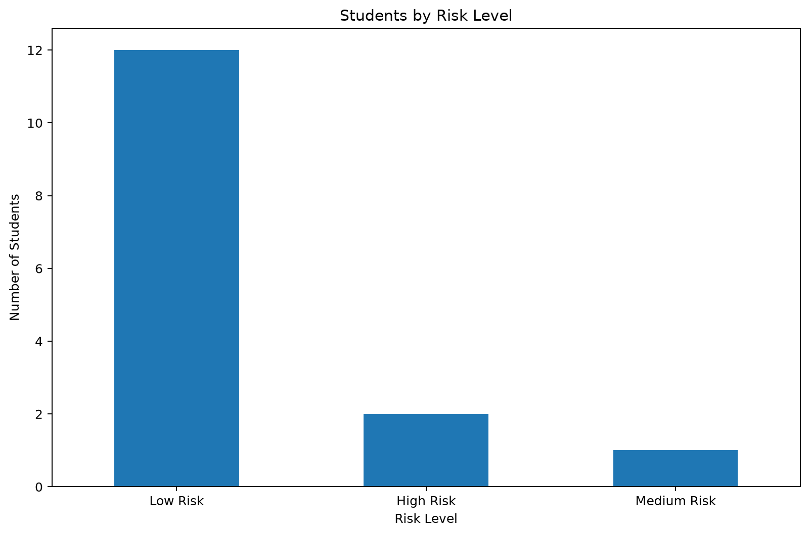

# Student Performance Analytics

A polished Python data science project that cleans student records, calculates academic performance metrics, identifies students who may need academic support, and presents the results through an interactive Streamlit dashboard.

## Features

The Streamlit dashboard in `dashboard/app.py` provides a complete interactive analysis experience:

* Loads student records from `data/students.csv`.
* Cleans and prepares student data.
* Calculates each student's average across Assignments, Midterm, and Final scores.
* Classifies students into performance levels.
* Compares average performance by department and gender.
* Measures relationships between attendance, study hours, and average score.
* Lists the top-performing students.
* Detects students who may be at academic risk.
* Identifies specific risk factors.
* Provides interactive student search and filtering.
* Provides individual student profiles.
* Compares two students.
* Provides department performance analysis.
* Provides risk summaries.
* Generates automated data-driven insights.
* Provides interactive charts and visualizations.
* Allows filtered student data to be downloaded as CSV.
* Allows individual student reports to be downloaded.
* Includes a dashboard filter reset option.

## Requirements

* Python 3.10 or newer
* pandas
* numpy
* matplotlib
* seaborn
* streamlit

The exact dependency ranges are recorded in `requirements.txt`.

## Setup

Open a terminal in the project directory and create a virtual environment:

```powershell
python -m venv .venv
```

Activate it on Windows PowerShell:

```powershell
.\.venv\Scripts\Activate.ps1
```

Install the dependencies:

```powershell
python -m pip install -r requirements.txt
```

On systems where `python` is not available, use the Python launcher instead:

```powershell
py -3 -m venv .venv
```

```powershell
.\.venv\Scripts\Activate.ps1
```

```powershell
py -3 -m pip install -r requirements.txt
```

## Run the Project

Run the Streamlit dashboard from the project root:

```powershell
streamlit run dashboard/app.py
```

The dashboard will open in your web browser.

The application provides interactive filters, student profiles, performance analysis, risk analysis, student comparison, department analysis, automated insights, visualizations, and downloadable reports.

## Analysis Rules

### Average Score

The average score is calculated as:

```text
(Assignments + Midterm + Final) / 3
```

### Performance Classification

| Average Score | Performance Level |
| ------------- | ----------------- |
| 80 or higher  | Excellent         |
| 70 to 79.99   | Good              |
| 60 to 69.99   | Average           |
| Below 60      | Needs Improvement |

### At-Risk Detection

A student may be identified as being at academic risk when one or more of the following conditions are present:

* Average score is below 60.
* Attendance is below 75 percent.
* Study hours are below 8.

Risk levels are assigned according to the number of triggered conditions:

| Triggered Conditions | Risk Level  |
| -------------------- | ----------- |
| 0                    | Low Risk    |
| 1                    | Medium Risk |
| 2 or more            | High Risk   |

The dashboard also identifies specific reasons such as `Low Academic Score`, `Low Attendance`, or `Low Study Hours`.

## Input Data

The default input file is `data/students.csv`.

It contains these columns:

| Column        | Description                   |
| ------------- | ----------------------------- |
| `Student_ID`  | Unique student identifier     |
| `Name`        | Student name                  |
| `Gender`      | Student gender                |
| `Age`         | Student age                   |
| `Study_Hours` | Study hours used for analysis |
| `Attendance`  | Attendance percentage         |
| `Assignments` | Assignment score              |
| `Midterm`     | Midterm score                 |
| `Final`       | Final examination score       |
| `Department`  | Academic department           |

To use another dataset, replace `data/students.csv` while preserving these column names and compatible values.

## Dashboard Outputs

The dashboard provides:

* Filtered student records
* Individual student reports
* Downloadable CSV data
* Student comparisons
* Department performance analysis
* Top-performing students
* Risk summaries
* Automated insights
* Academic performance visualizations

## Visualizations

The repository includes example charts generated from the supplied student dataset.

### Score Distribution



### Average Performance by Department



### Attendance Versus Student Performance



### Student Performance Levels



### Risk Levels



### Risk Level Breakdown


## Project Structure

```text
student-performance-analytics/
│
├── dashboard/
│   └── app.py
│
├── data/
│   └── students.csv
│
├── src/
│   ├── clean_data.py
│   ├── statistics.py
│   └── insights.py
│
├── requirements.txt
└── README.md
```

## Showcase Highlights

The included dataset demonstrates how data science can be used to move beyond simple averages and identify meaningful academic patterns.

The project demonstrates:

* Student academic performance analysis.
* Department and gender comparisons.
* Attendance and study-hours analysis.
* Student risk identification.
* Automated data-driven insights.
* Interactive data visualization.
* Individual student analysis.
* Student-to-student comparison.
* Downloadable reports and filtered datasets.
* An interactive Streamlit dashboard suitable for a data science portfolio.

The charts included in this README provide visual examples of the analysis performed by the project.

## Troubleshooting

### `ModuleNotFoundError`

Make sure the dependencies are installed in the same Python environment used to run the project:

```powershell
python -m pip install -r requirements.txt
```

### Streamlit Command Not Found

Try:

```powershell
python -m streamlit run dashboard/app.py
```

### Input File Not Found

Make sure you are running the command from the project root and that the following file exists:

```text
data/students.csv
```

### Dashboard Does Not Open

Run:

```powershell
streamlit run dashboard/app.py
```

or:

```powershell
python -m streamlit run dashboard/app.py
```

## Notes

* This project is designed as an interactive web-based analytics dashboard using Streamlit.
* Correlation values describe relationships in the supplied dataset; they do not establish causation.
* The dashboard analysis updates according to the selected filters.
* The project is intended as a practical demonstration of Python, Pandas, data analysis, data visualization, and Streamlit dashboard development.
