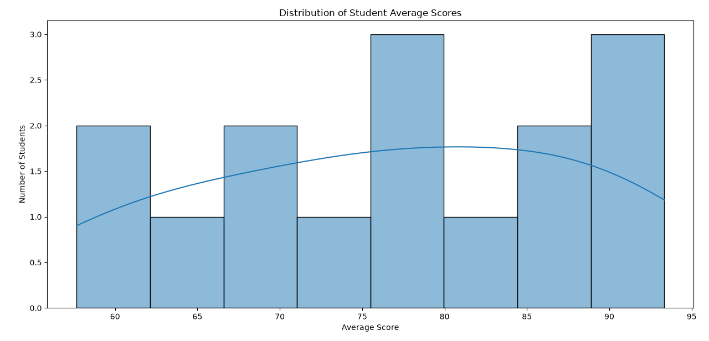

# Student Performance Analytics

A Python data analysis project that cleans student records, calculates academic performance metrics, identifies students who may need support, and produces summary statistics and visualizations.

## Features

The program in `main.py` runs the complete analysis pipeline:

- Loads student records from `data/students.csv`.
- Removes duplicate rows and rows containing missing values.
- Converts numeric fields to floating-point values.
- Calculates each student's average across Assignments, Midterm, and Final scores.
- Classifies students into performance levels.
- Compares average performance by department and gender.
- Measures the correlation between attendance, study hours, and average score.
- Lists the top-performing students.
- Reports the highest score, lowest score, and score difference.
- Detects students who may be at academic risk and explains the risk factors.
- Displays four charts for score distribution, department performance, attendance, and performance levels.
- Saves cleaned and enriched datasets as CSV files.

## Requirements

- Python 3.10 or newer
- pandas
- matplotlib
- seaborn

## Setup

Open a terminal in the project directory and create a virtual environment:

```powershell
python -m venv .venv
```

Activate it on Windows PowerShell:

```powershell
.\.venv\Scripts\Activate.ps1
```

Install the dependencies:

```powershell
python -m pip install pandas matplotlib seaborn
```

On systems where `python` is not available, use the Python launcher instead:

```powershell
py -3 -m venv .venv
.\.venv\Scripts\Activate.ps1
py -3 -m pip install pandas matplotlib seaborn
```

## Run the Project

Run the command from the project root, where the `data` and `outputs` directories are visible:

```powershell
python main.py
```

The program prints intermediate data, analysis results, correlations, score summaries, and at-risk students to the terminal. Four visualization windows are displayed during execution. Close each plot window to allow the script to continue to the next chart.

## Analysis Rules

### Average score

The average score is calculated as:

```text
(Assignments + Midterm + Final) / 3
```

### Performance classification

| Average score | Performance level |
| --- | --- |
| 80 or higher | Excellent |
| 70 to 79.99 | Good |
| 60 to 69.99 | Average |
| Below 60 | Needs Improvement |

### At-risk detection

A student is included in the at-risk list when at least one of these conditions is true:

- Average score is below 60.
- Attendance is below 75 percent.
- Study hours are below 8.

Risk levels are assigned using the number of triggered conditions:

| Triggered conditions | Risk level |
| --- | --- |
| 0 | Low Risk |
| 1 | Medium Risk |
| 2 or more | High Risk |

The report also lists the specific reasons, such as `Low Academic Score`, `Low Attendance`, or `Low Study Hours`.

## Input Data

The default input file is `data/students.csv`. It contains these columns:

| Column | Description |
| --- | --- |
| `Student_ID` | Unique student identifier |
| `Name` | Student name |
| `Gender` | Student gender |
| `Age` | Student age |
| `Study_Hours` | Study hours used for analysis |
| `Attendance` | Attendance percentage |
| `Assignments` | Assignment score |
| `Midterm` | Midterm score |
| `Final` | Final examination score |
| `Department` | Academic department |

To use another dataset, replace `data/students.csv` while preserving these column names and compatible values.

## Generated Files

The script creates these files in `outputs/`:

- `student_performance_results.csv`: cleaned records with average scores and performance levels.
- `student_performance_with_risk.csv`: the enriched results with risk levels and risk reasons.

The charts are displayed with `matplotlib` during execution. The current script does not automatically save new chart image files; the repository includes the example images below.

## Visualizations

The repository includes example charts generated from the supplied student dataset.

### Score Distribution



### Average Performance by Department


### Attendance Versus Student Performance


### Student Performance Levels


## Project Structure

```text
student-performance-analytics/
|-- data/
|   `-- students.csv
|-- outputs/
|   |-- student_performance_results.csv
|   `-- student_performance_with_risk.csv
|-- src/
|   |-- analysis.py       # Scores, classifications, summaries, and correlations
|   |-- clean_data.py     # Duplicate, missing-value, and numeric conversion handling
|   |-- load_data.py      # CSV loading
|   |-- statistics.py     # At-risk detection and risk explanations
|   `-- visualization.py  # Seaborn and Matplotlib charts
|-- main.py               # End-to-end execution script
`-- README.md
```

## Troubleshooting

### `ModuleNotFoundError`

Install the dependencies into the same interpreter used to run the project:

```powershell
python -m pip install pandas matplotlib seaborn
```

### Input file not found

Run `main.py` from the project root. The loader uses the relative path `data/students.csv`.

### Charts do not appear

Run the script in a desktop Python environment with a graphical Matplotlib backend. In a headless environment, set a non-interactive backend before importing Matplotlib, for example:

```powershell
$env:MPLBACKEND = "Agg"
python main.py
```

With a non-interactive backend, the analysis runs but chart windows will not be shown.

## Notes

- This project is designed as a command-line analytics script rather than a web application.
- Correlation values describe the relationship in the supplied dataset; they do not establish causation.
- The output CSV files in `outputs/` may be regenerated each time the script runs.
